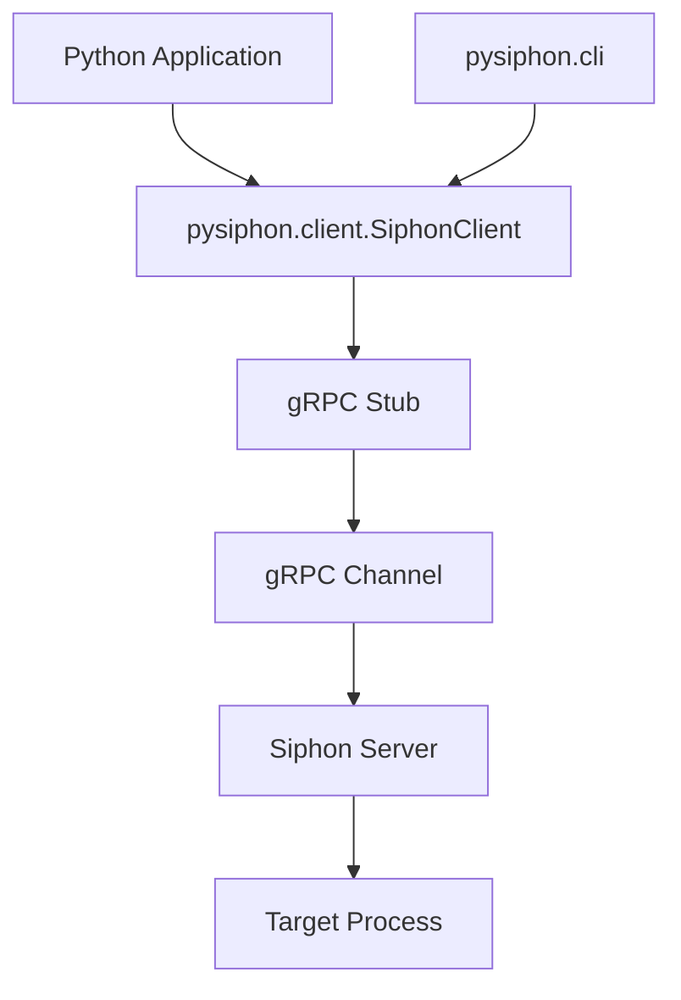

# Implementation Details

Technical details about the pysiphon implementation.

## Architecture

pysiphon is built as a gRPC client that communicates with the Siphon service.



## Package Structure

```
pysiphon/
├── __init__.py              # Package exports
├── client.py                # Core SiphonClient class (~650 lines)
├── cli.py                   # CLI interface (~630 lines)
├── utils.py                 # Helper functions (~150 lines)
└── generated/               # Generated gRPC code
    ├── __init__.py
    ├── siphon_service_pb2.py        # Protobuf messages
    └── siphon_service_pb2_grpc.py   # gRPC service stubs
```

## Core Components

### SiphonClient (`client.py`)

The main client class that wraps all gRPC communication.

**Key Features:**

- Context manager support for automatic cleanup
- 100MB message size limits (matching C++ client)
- Consistent dictionary return values
- Comprehensive error handling

**Method Categories:**

1. **Initialization**: Config loading, memory/input/capture setup
2. **Attributes**: Get/set with type conversion
3. **Input**: Keyboard and mouse control
4. **Capture**: Screenshot functionality
5. **Execution**: Remote command execution
6. **Recording**: High-frequency data recording

### CLI (`cli.py`)

Dual-mode CLI built with Click framework.

**Modes:**

1. **Interactive**: REPL-style session with command history
2. **Single-command**: Direct execution with proper exit codes

**Features:**

- Global `--host` option for server selection
- Comprehensive help system
- Shell completion support
- Error handling with meaningful messages

### Utilities (`utils.py`)

Helper functions for common operations.

**Functions:**

- `hex_to_bytes()` / `bytes_to_hex()` - Hex string conversion
- `parse_config_file()` - TOML configuration parsing
- `save_frame_image()` - Image saving with format detection
- `format_bytes_size()` - Human-readable byte formatting

## gRPC Integration

### Channel Configuration

```python
options = [
    ('grpc.max_receive_message_length', 100 * 1024 * 1024),  # 100MB
    ('grpc.max_send_message_length', 100 * 1024 * 1024),     # 100MB
]
channel = grpc.insecure_channel(host, options=options)
stub = pb2_grpc.SiphonServiceStub(channel)
```

### RPC Call Pattern

All RPC methods follow this pattern:

```python
def rpc_method(self, params) -> Dict[str, Any]:
    try:
        request = pb2.RequestType()
        # Populate request
        
        response = self.stub.RpcMethod(request)
        
        return {
            "success": response.success,
            "message": response.message,
            # Additional fields
        }
    except grpc.RpcError as e:
        return {
            "success": False,
            "message": f"RPC failed: {e.details()}"
        }
```

### Streaming RPC (Download)

```python
def download_recording(self, session_id: str, output_path: str) -> bool:
    request = pb2.DownloadRecordingRequest()
    request.session_id = session_id
    
    with open(output_path, 'wb') as f:
        for chunk in self.stub.DownloadRecording(request):
            f.write(chunk.data)
            # Progress tracking
            if chunk.is_final:
                break
    
    return True
```

## Type Handling

### Oneof Fields

Protobuf `oneof` fields require special handling:

```python
# Get attribute (oneof value)
value_case = response.WhichOneof("value")

if value_case == "int_value":
    return {"value": response.int_value, "value_type": "int"}
elif value_case == "float_value":
    return {"value": response.float_value, "value_type": "float"}
# etc.
```

```python
# Set attribute (oneof value)
if value_type == "int":
    request.int_value = int(value)
elif value_type == "float":
    request.float_value = float(value)
# etc.
```

### Type Conversions

| Python Type | Protobuf Type | Notes |
|-------------|---------------|-------|
| `int` | `int32` | 32-bit signed |
| `float` | `float` | 32-bit IEEE 754 |
| `bytes` | `bytes` | Direct mapping |
| `bool` | `bool` | Direct mapping |

## Image Processing

Frames are captured in BGRA format and converted to RGBA for PIL:

```python
# BGRA to RGBA conversion
pixel_array = bytearray(pixels)
for i in range(0, len(pixel_array), 4):
    # Swap B and R channels
    pixel_array[i], pixel_array[i+2] = pixel_array[i+2], pixel_array[i]

# Create PIL Image
img = Image.frombytes("RGBA", (width, height), bytes(pixel_array))
```

### Format Detection

File format is determined by extension:

```python
# Auto-convert for JPEG (no alpha channel)
if filename.lower().endswith(('.jpg', '.jpeg')):
    img = img.convert("RGB")

img.save(filename)  # PIL detects format from extension
```

## Configuration Parsing

TOML files are parsed using `tomli`:

```python
with open(config_path, "rb") as f:
    config = tomli.load(f)

# Extract process info
process_name = config["process_info"]["name"]

# Extract attributes
for attr_name, attr_config in config["attributes"].items():
    # Build protobuf message
    attr_proto = request.attributes.add()
    attr_proto.name = attr_name
    attr_proto.pattern = attr_config["pattern"]
    attr_proto.offsets.extend(attr_config["offsets"])
    # etc.
```

## Error Handling

### Consistent Return Values

All methods return dictionaries with at least:

```python
{
    "success": bool,    # Operation succeeded
    "message": str,     # Human-readable message
    # ... method-specific fields
}
```

### Exception Handling

```python
try:
    response = self.stub.Method(request)
    return {"success": response.success, ...}
except grpc.RpcError as e:
    return {"success": False, "message": f"RPC failed: {e.details()}"}
except Exception as e:
    return {"success": False, "message": f"Error: {str(e)}"}
```

## CLI Implementation

### Interactive Mode

Uses a simple command loop:

```python
while True:
    command_line = input("\n> ").strip()
    parts = command_line.split()
    command = parts[0].lower()
    args = parts[1:]
    
    if command == "get":
        # Handle get command
    elif command == "set":
        # Handle set command
    # etc.
```

### Single-Command Mode

Uses Click's command groups:

```python
@cli.group()
@click.option('--host', default='localhost:50051')
def cli(host):
    # Setup
    pass

@cli.command()
@click.argument('attribute')
def get(attribute):
    # Handle get command
    pass
```

## Performance Considerations

### Recording Performance

Target: 60 FPS (16.67ms per frame)

Factors affecting performance:
- Number of attributes
- Attribute complexity (array vs int)
- Network latency
- System load

### Optimization Techniques

1. **Reuse connections**: Single channel for all operations
2. **Binary format**: Protobuf is efficient
3. **Streaming**: Download uses streaming RPC
4. **Context managers**: Automatic cleanup

## Testing Approach

Manual testing covers:

1. **Imports**: Package structure
2. **CLI**: Both modes, all commands
3. **API**: All public methods
4. **Error handling**: Invalid inputs, connection failures
5. **Performance**: Recording at target FPS

## Code Generation

gRPC code is generated from `siphon_service.proto`:

```bash
python -m grpc_tools.protoc -I. \
    --python_out=pysiphon/generated \
    --grpc_python_out=pysiphon/generated \
    siphon_service.proto
```

**Post-generation fix required:**

```python
# In pysiphon/generated/siphon_service_pb2_grpc.py
# Change:
import siphon_service_pb2 as siphon__service__pb2

# To:
from . import siphon_service_pb2 as siphon__service__pb2
```

## Dependencies

### Runtime Dependencies

- **grpcio**: gRPC framework
- **grpcio-tools**: Protobuf compiler
- **tomli**: TOML parsing (Python 3.10 compatible)
- **Pillow**: Image processing
- **click**: CLI framework

### Development Dependencies

- **mkdocs**: Documentation generator
- **mkdocs-material**: Material theme
- **mkdocstrings**: API documentation
- **pymdown-extensions**: Markdown extensions

## Differences from C++ Client

Python implementation adds:

1. **Context managers**: `with SiphonClient() as client:`
2. **PIL integration**: Direct PIL Image objects
3. **Dictionary returns**: Consistent return format
4. **Type inference**: Automatic in `get_attribute()`
5. **CLI flexibility**: Both interactive and single-command modes

Maintains:

1. **All RPC methods**: Complete feature parity
2. **Message sizes**: 100MB limits
3. **Error handling**: Consistent patterns
4. **Recording**: Same HDF5 format

## Future Enhancements

Potential improvements:

- Async API support
- Connection pooling
- Caching layer
- Type stubs (PEP 561)
- Progress callbacks
- Batch operations
- WebSocket alternative

## References

- [gRPC Python Documentation](https://grpc.io/docs/languages/python/)
- [Protocol Buffers](https://developers.google.com/protocol-buffers)
- [Click Documentation](https://click.palletsprojects.com/)
- [MkDocs](https://www.mkdocs.org/)

