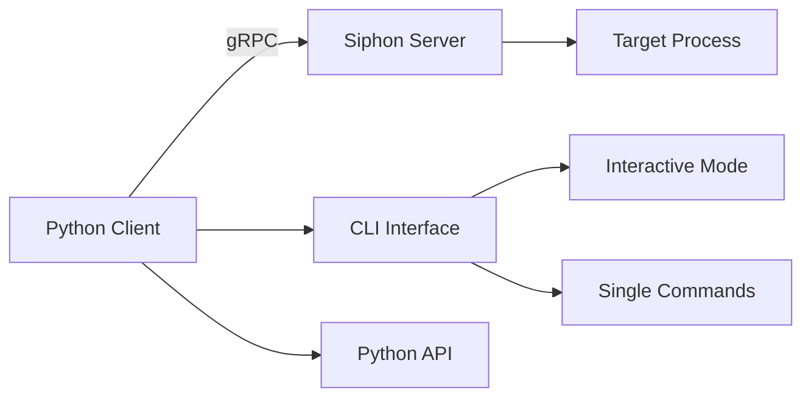

# pysiphon


Python gRPC client for Siphon service - provides memory manipulation, input control, screen capture, and recording capabilities.

## Features

- **Full Feature Parity** with C++ client
- **Dual-Mode CLI**: Interactive REPL and single-command execution
- **Programmatic API**: Use as a Python library
- **Complete RPC Coverage**: All Siphon service methods supported

### Core Capabilities

=== "Memory Manipulation"

    Read and write process memory with support for multiple data types:
    
    - Integer values (32-bit)
    - Float values (32-bit)
    - Byte arrays (arbitrary length)
    - Boolean values
    
    Pattern-based address resolution with offset chains.

=== "Input Control"

    Full keyboard and mouse control:
    
    - Key tap with timing control
    - Key toggle (press/release)
    - Mouse movement with interpolation
    - Multi-key combinations

=== "Screen Capture"

    Capture window frames with:
    
    - PIL Image output
    - Multiple format support (PNG, JPG, BMP, etc.)
    - BGRA to RGBA conversion
    - Direct file saving

=== "Recording"

    High-performance recording to HDF5:
    
    - 60 FPS target recording
    - Multiple attribute tracking
    - Real-time status monitoring
    - Performance metrics

## Quick Example

```python
from pysiphon import SiphonClient

# Connect and initialize
with SiphonClient("localhost:50051") as client:
    client.init_all("config.toml")
    
    # Get attribute
    result = client.get_attribute("health")
    print(f"Health: {result['value']}")
    
    # Set attribute
    client.set_attribute("speed", 100, "int")
    
    # Capture screenshot
    client.capture_and_save("screenshot.png")
    
    # Input control
    client.input_key_tap(["w"], 50, 0)
```

## CLI Example

```bash
# Interactive mode
pysiphon interactive

# Single commands
pysiphon init config.toml
pysiphon get health
pysiphon capture screenshot.png
```

## Installation

```bash
# Install with pip
pip install -e .

# Or with uv
uv pip install -e .

# Install with docs dependencies
pip install -e ".[docs]"
```

## Architecture



## Next Steps

- [Installation Guide](getting-started/installation.md) - Set up pysiphon
- [Quick Start](getting-started/quickstart.md) - Get started in 5 minutes
- [Python API Guide](guide/api.md) - Programmatic usage
- [CLI Usage](guide/cli.md) - Command-line interface
- [API Reference](api/client.md) - Complete API documentation

## Requirements

- Python >= 3.10
- grpcio >= 1.59.0
- Pillow >= 10.0.0
- click >= 8.1.0
- tomli >= 2.0.1

## License

See LICENSE file for details.

